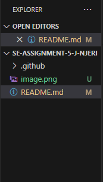
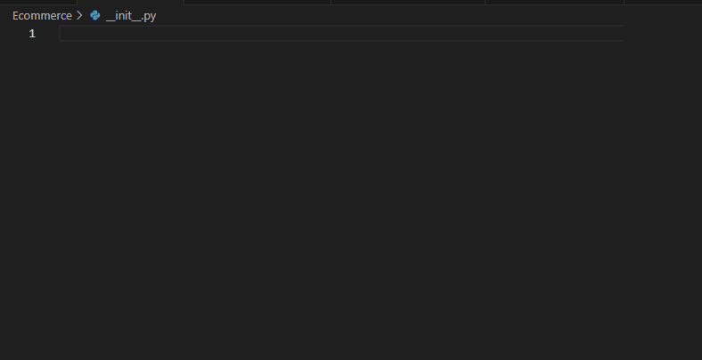
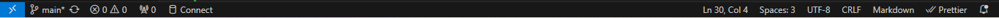
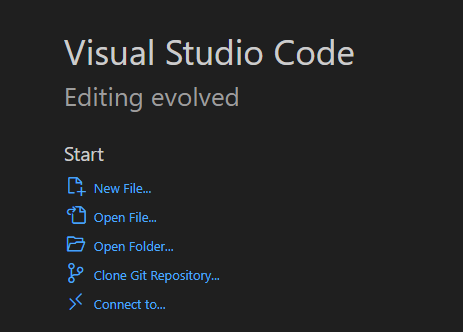
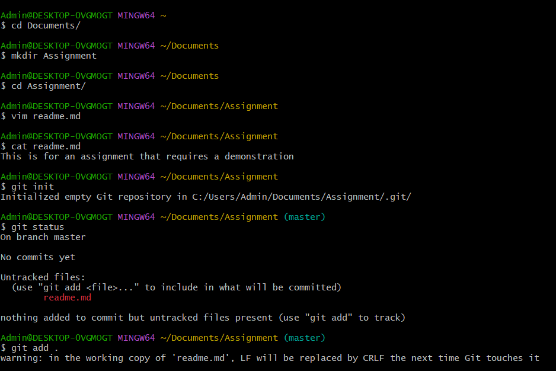
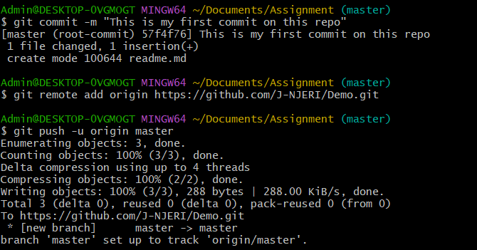

# SE-Assignment-5
Installation and Navigation of Visual Studio Code (VS Code)
 Instructions:
Answer the following questions based on your understanding of the installation and navigation of Visual Studio Code (VS Code). Provide detailed explanations and examples where appropriate.

 Questions:

1. Installation of VS Code:
   - Describe the steps to download and install Visual Studio Code on Windows 11 operating system. Include any prerequisites that might be needed.

   Visit https://visualstudio.microsoft.com/ and click Download Visual Studio. Once done, run the downloaded installer(VSCodeUserSetup-x64-1.89.1) as administrator and choose any preferred settings to install VS Code.

2. First-time Setup:
   - After installing VS Code, what initial configurations and settings should be adjusted for an optimal coding environment? Mention any important settings or extensions.

   Initial configurations and settings that should be adjusted include prefernces such as the theme, default font and other settings to one's liking. There are also some basic extensions one should install to start them off such as Code Runnner and Prettier(preferably the verified ones).

3. User Interface Overview:
   - Explain the main components of the VS Code user interface. Identify and describe the purpose of the Activity Bar, Side Bar, Editor Group, and Status Bar.

   The Activity Bar is located on the far left side of the VS Code window. It provides quick access to different views and primary functions of VS Code such as Explorer, Search, Source Control, Run and Debug, Extensions. The image below shows the activity bar.
   
   The Side Bar is positioned next to the Activity Bar and provides detailed views and tools related to the selected activity from the Activity Bar. The image below shows the side bar.
   
   The Editor Group is the central area where you open and edit your files. It supports multiple editors in separate tabs and split views. It is the main area where we write and edit codes.
   
   The Status Bar is located at the bottom of the VS Code window. It provides information about the current state of the editor and the workspace including information such as line and column numbers, file encoding, language mode, Git branch, and errors.
   

4. Command Palette:
   - What is the Command Palette in VS Code, and how can it be accessed? Provide examples of common tasks that can be performed using the Command Palette.

   The Command Palette in Visual Studio Code is a powerful tool that  allows users to execute commands, perform tasks, and navigate the editor efficiently without needing to remember complex keyboard shortcuts or navigate through menus.
   It is accessed by clicking 'View' then 'Command Palette' or by using the shortcut 'ctrl+shift+P'.
   Examples of common tasks that can be performed incude: opening files anf folders and changing preferences such as theme color.

5. Extensions in VS Code:
   - Discuss the role of extensions in VS Code. How can users find, install, and manage extensions? Provide examples of essential extensions for web development.

   Extensions enhance the functionality of VS Code and allow developers to customize their development environment. One can find extensions in the activity bar (on the far left of the UI) or by using the shortcut 'ctrl+shift+X'. All that is remaining is to search for the desired extension, click install or any other action such as disable. 
   Examples of essential extensions include Prettier, Code Runner and Intellisense.

6. Integrated Terminal:
   - Describe how to open and use the integrated terminal in VS Code. What are the advantages of using the integrated terminal compared to an external terminal?

   The integrated terminal in VS Code allows developers to run command-line tasks directly within the editor. To open the terminal, click on 'View' then 'Terminal' or the three dots on the menu then 'terminal' then 'new terminal'.To use the terminal, click on the plus sign to choose preferred terminal instance and type your commands as you would in any standard terminal and press Enter to execute them. 
   Some advantages of using the integrated terminal are: This integration makes it easy to interact with your code, version control, and other tools in a single environment and it allows one to pen and manage multiple terminal instances and tabs within the same window.

7. File and Folder Management:
   - Explain how to create, open, and manage files and folders in VS Code. How can users navigate between different files and directories efficiently?

   When VS Code is launched, a welcome window appears that contains prompts of whether one wishes to create a new file or open existing files and folders from where they are stored in the machine.
   
   Alternatively, click on file, then either choose to create a new file (New File/ctrl+Alt+Windows+N) or to open existing files or folders(Open File/ctrl+O and Open Folder/ctrl+K+ctrl+O)
   To manage a file, right click the file on the explorer side bar and either rename or delete the file.
   Users can navigate between different files and directories efficiently  by using the explorer view.

8. Settings and Preferences:
   - Where can users find and customize settings in VS Code? Provide examples of how to change the theme, font size, and keybindings.

   Click on file then preferences to get a list of the different settings one can change. To change the theme, follow the sequence 'File-Preference-theme'. To change font size, follow the sequence 'File-Preference- Settings- Font size'. To access keybindings, follow the sequence 'File-Preference-keyboard shortcuts'.

9. Debugging in VS Code:
   - Outline the steps to set up and start debugging a simple program in VS Code. What are some key debugging features available in VS Code?

   Setting up and starting debugging in VS Code involves configuring a launch configuration for your program, setting breakpoints, then starting the debugger by clicking the green play button in the Run and Debug view. Some key debugging features include breakpoints(to pause the execution of your program at specific lines of code) and debug console (used to execute commands and evaluate expressions in the context of the currently running program).

10. Using Source Control:
    - How can users integrate Git with VS Code for version control? Describe the process of initializing a repository, making commits, and pushing changes to GitHub.

    
   
   By executing the git commands in the images, it is possible to initialise a repository, make commits and push the changes to github. If any changes are made to the folder, you just execute 'git add, git commit and git push'.

 Submission Guidelines:
- Your answers should be well-structured, concise, and to the point.
- Provide screenshots or step-by-step instructions where applicable.
- Cite any references or sources you use in your answers.
- Submit your completed assignment by 1st July 

